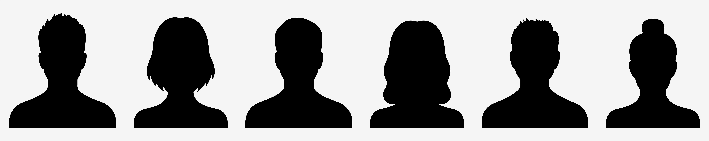
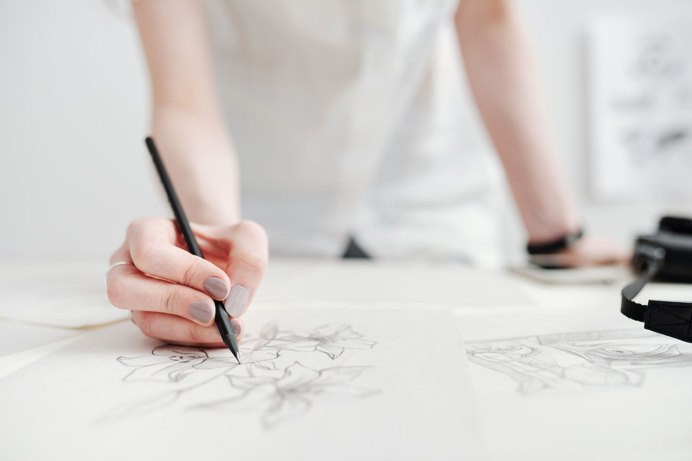
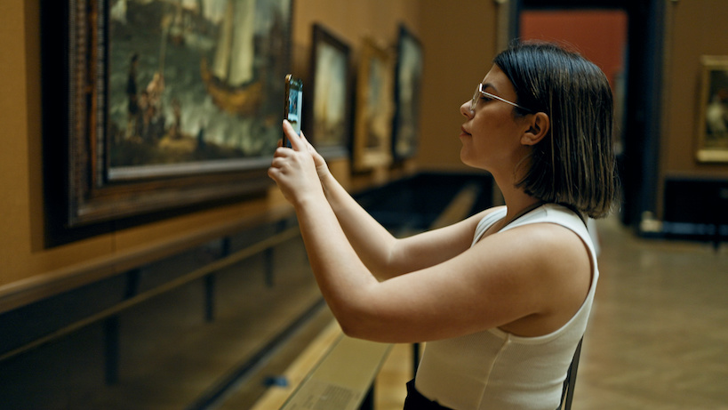

:::::::::::::::::::::::::::::::::::::: questions 

- To understand copyright law in the UK.
- To be aware of the impact of the 
copyright legislation on personal
practice for collecting 
multidimensional data.

::::::::::::::::::::::::::::::::::::::::::::::::

## What is copyright?
{alt="Copyright is a legal right, which protects the copyright owner and/or the creator of a work."}

Copyright is a legal right, which protects the copyright **owner** and/or the **creator** of a work.

Copyright gives the owner **control** over their work and how it is used.

There are four areas of **intellectual property**:

  - **Copyright**: what the work is. 
  - **Patents**: how something works.
  - **Designs**: what something looks like.
  - **Trademark**: what you call it.

Works use the copyright symbol (©), a name and the year of creation.

## Who owns the copyright?

{alt='Authors automatically get copyright protection when the work is created.'}
There is no system in the UK for registering copyright. 

Authors automatically get copyright protection when the work is created.

Unless the work was created by an employee during their employment, or the copyright is transferred to someone else as part of their agreement. 

## What works does copyright protect?

There is no copyright protection for ideas/concepts. 

Copyright only protects  works when ideas are 
**expressed** in a form that can be reproduced or copied:

  - **Original literary**, dramatic, musical and artistic work, including illustration and photography.
  - **Original non-literary written work**, such as software, web content and databases.
  - **Sound and music** recordings.
  - **Film and television** recordings.
  - **Broadcasts**.
  - **The layout** of published editions of written, dramatic and musical works. 

## Multiple independent copyrights

{alt='The copyright in each type of work exists independently.'}

The copyright in each type of work exists 
**independently**.

For example, a song may be covered by copyright:

- on the **entire collectio**n which contains the song.
- on the **lyrics** as a literary work.
- on the **music** of the song as its performance.

## How copyright protects work

Copyright prevents people from:

  - **copying** work
  - putting someone's work on the **Internet**.
  - **distributing** copies of someone's work, whether free of     
  charge or for sale    
  - **renting** or **lending** copies of someone's work
  - making an **adaptation** of someone's work
  - **performing**, **showing** or **playing** someone's work in public

## Exceptions

There are certain [exceptions](https://www.gov.uk/guidance/exceptions-to-copyright), 
especially in the case of photographs, 
films and recorded sound.

For example:

- making content accessible for disabled people.
- text and data mining for research.
- teaching, fair dealing and more.

See more information: [https://www.gov.uk/guidance/exceptions-to-copyright#non-commercial-research-and-private-study](https://www.gov.uk/guidance/exceptions-to-copyright#non-commercial-research-and-private-study)

## Copyright duration

Copyright protection starts as soon 
as a work is created. 

After copyright expires, 
the work is in the **public domain** 
so anyone can use or copy the works.

|  Type of work   | How long copyright usually last         |
|-----------------|-----------------|
| Written, dramatic, musical and artistic work      | 70 years after the author's death    |
| Sound and music recording    | 70 years from when it's first published    |
| Films    | 70 years after the death of the director, screenplay author and composer   |
| Broadcasts    | 50 years from when it's first broadcast    |
| Layout of published editions of written, dramatic or musical works    | 25 years from when it's first published    |

Source: [https://www.gov.uk/copyright/how-long-copyright-lasts](https://www.gov.uk/copyright/how-long-copyright-lasts)

](fig/crown-copyright-flowchart.png){alt="flowchart1"}

](fig/excluding-crown-copyright-flowchart.png){alt="flowchart2"}

## Copyright owner: employees, freelancers and commissions

The copyright is an automatic right and 
does not need to be registered 
or paid for (by its owner).

The first owner of copyright 
will normally be the **author**
(who created the work).

An **employer** is usually the 
first owner of copyright in work which 
is made in the course of an **author's** 
employment under a contract. 

For **commissioned work** and **freelancers**, the copyright 
usually lies with the **person who creates 
the work** unless
it is specified in the contract. Hence, it is 
important when commissioning work 
to put an agreement in place first 
covering the intellectual property of the 
resulting work.   

## Copyright of Images in UK law

{alt="Photographs, illustrations and other 
images will generally be protected by 
copyright as artistic works."}
Photographs, illustrations and other 
images will generally be protected by 
copyright as **artistic works**.

The copyright owner of a photograph
is its **creator**, for example, 
the photographer or the 
organisation/employer with which 
the photographer has a contractual agreement.

The creator of an image may choose to allow 
a person or organisation to **license**
the work on their behalf, license the copyright 
directly themselves, or "assign" (transfer) 
the copyright to another person.

Copyright in images lasts for the 
**life of the creator plus 70 years** 
from the end of the calendar year 
of their death. 

Hence, the length 
of the copyright period will 
depend on when the image was created. 

{alt="Moreover, digital images covered by copyright protection include digital photos from digital cameras."}

Moreover, **digital images** covered by copyright 
protection include:

- Digital photos taken on mobile phones 
and digital cameras.
- Images that were first generated on 
photographic film and any digital images 
created from them.
- Images such as diagrams and illustrations.

## Copyright resulting from digitisation works

{alt="Digitising, if understood as making a digital copy, is copying. This right is reserved to the copyright owner as we already
established."}

Digitising, if understood as making a digital copy, is copying.
This right is reserved to the copyright owner as we already
established. 

Creating **a 2D digital image of a creative work**, 
such as a painting, is unlikely to create new copyright 
in the digitised version.

There is some uncertainty regarding whether 
copyright can exist in **digital images** 
of older works (e.g. a painting or
manuscript) for which copyright has expired.
This is because the effort in the creation of the 
digital photograph is negligible. 

New copyright will only arise in such digital copies 
if **specialist skills** have been used 
to optimise details (i.e. retouching images).

Uncertainty is due that according to established case law, 
copyright can only subsist in subject 
matter that is original in the sense that 
it is the author's own **‘intellectual creation'**.

Following this argument, there is potential 
for claiming **copyright in a 3D digital image** as a
[higher degree of skills goes into creating it](https://www.jisc.ac.uk/guides/3d-digitisation-and-intellectual-property-rights).

<!--## Database rights
An electronic database may be protected by copyright and database rights.

Database rights will cover a collection of copyrighted works.

Permission must have been obtained from the copyright holders for the use of their work.

Database rights are automatic and have no registration forms or fees and give the owner total control over their work. You can use, sell or lease it to a third party.

Database rights last for 15 years from creation, but if published during this time the term is 15 years from publication. -->  

