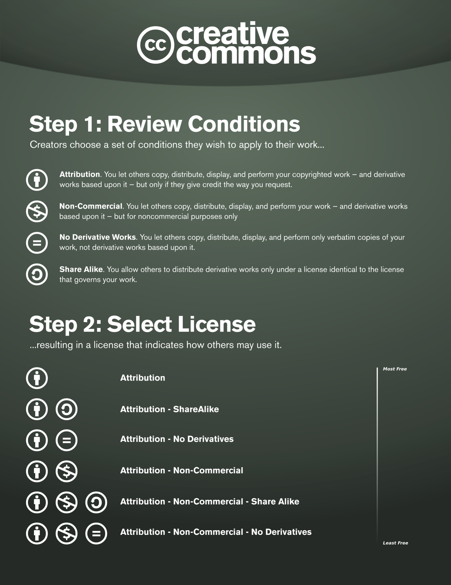

::::: questions

- Describes what is a license.
- Covers the Creative Commons licenses, as an example
of other potential agreements with copyright owners.

::::: 

## Licensing copyrighted work
Licences are **contractual agreements** between the 
copyright owner/s and user/s limiting how the work can be used. 

[Examples of licences](https://www.jisc.ac.uk/guides/copyright-law/licences) are:

- [Jisc Model Licence](https://subscriptionsmanager.jisc.ac.uk/about/jisc-model-licence)
- Copyright owners can be represented by a collecting society who
negotiates licenses with users, e.g. [Spotify](https://www.spotify.com/uk/legal/spotify-for-artists-terms-and-conditions/), [CLA](https://www.cla.co.uk)
- [Creative Commons](https://creativecommons.org/share-your-work/cclicenses/)

Creative Works where a copyright owner is unknown or untraceable are known
as **Orphan Works**. Guidance on how to deal with this cases is available from the
[UK government](https://www.gov.uk/guidance/copyright-orphan-works).

## Creative Commons Licenses (CC)

Creative Commons licenses are a **standardised way to grant copyright permissions** 
to creative work by individuals, 
organisations and institutions.

They  help creators to **retain copyright** 
while allowing others to **copy, distribute, and make some uses** 
of their work.

They are designed to be easy to use and understand by stating
in simple terms what the user is allowed to do, and under
which conditions.

They all have common **features** which serve as baseline. 
On top of which licensors can choose to grant additional permissions.

{alt='CC license'}

## Why open cultural heritage data?

### The Problem of the Yellow Milkmaid

>‘The Milkmaid’, one of Johannes Vermeer's most famous pieces, depicts a
scene of a woman quietly pouring milk into a bowl. During a survey the
Rijksmuseum discovered that there were over 10,000 copies of the image on
the internet—mostly poor, [yellowish reproductions](https://www.google.com/search?q=milk+maid+vermeer). As a result of all of these 
low-quality copies on the web, according to the Rijksmuseum, "people simply
didn't believe the postcards in our museum shop were showing the original
painting. This was the trigger for us to put high-resolution images of the
original work with open metadata on the web ourselves. Opening up our data
is our best defence against the ‘yellow Milkmaid’."

> Extract from Harry Verwayen, Martijn Arnoldus and Peter B. Kaufman (2011).
The Problem of the Yellow Milkmaid: A Business Model Perspective on Open Metadata.
(Acessed November 2023). URL: [https://pro.europeana.eu/post/the-problem-of-the-yellow-milkmaid](https://pro.europeana.eu/post/the-problem-of-the-yellow-milkmaid)

[Open Culture](https://creativecommons.org/about/arts-culture/) is an initative
from Creative Commons. 

It capitalises on the need to to empower creators anywhere in 
the world to discover, share, reuse and remix cultural heritage. 

More information:

- Creative Commons for GLAMS: [https://certificates.creativecommons.org/cccertedu/chapter/unit-5-creative-commons-for-glam/](https://certificates.creativecommons.org/cccertedu/chapter/unit-5-creative-commons-for-glam/)
- CC Needs and assessment report:
[https://creativecommons.org/2023/02/23/cc-needs-assessment-report-on-public-domain-tools-in-cultural-heritage-sector-unveils-key-insights/](https://creativecommons.org/2023/02/23/cc-needs-assessment-report-on-public-domain-tools-in-cultural-heritage-sector-unveils-key-insights/)

:::::::::: keypoints
## Using copyrighted work

To use a **creative work** protected by copyright 
it is generally advised:

1. Once you have found a **creative work** you would like
to use, you will need to determine the type of usage:
  - If it is not digitised, will you be producing
  a digital version?
  - Would you like to remix/change it? if so, Are you willing 
  to release the resulting **creative work** for further remixes?
  - Would you be using it for commercial purposes?
2. Understand the license which is currently offered with
the creative work and its restrictions.
3. If no license is available then find the owner of the copyright. 
Remember in many cases it might not be who holds the content.
4. If you are using the **creative work** for educational purposes,
confirm that your intended use falls within the exceptions to copyright.
5. If you require a license, agree with the owner one. Favour
the Creative Commons suite of licenses.
6. Ensure you attribute the **creative work** when making use of it.

::::::::::

